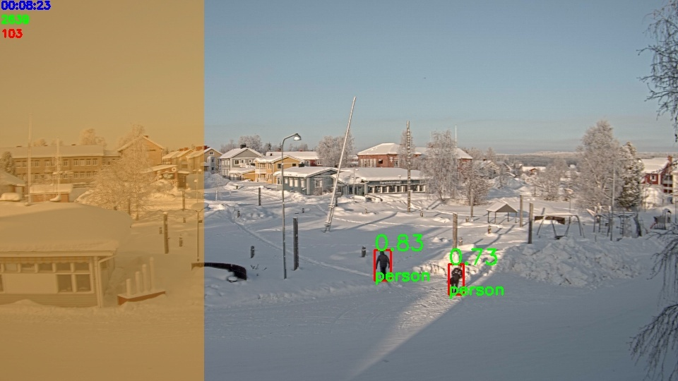

# Disclaimer

This documentation provides an overview of the current state of the project, acknowledging that it is currently in the beta phase. The project is fully functional, and ongoing development and refactoring efforts are planned for the future.
# Project Description

The primary objective of this project is to enhance any monitoring Network Video Recorder (NVR) system by incorporating live detection of specified objects (e.g., people, animals, cars). It utilizes the Real-Time Streaming Protocol (RTSP) functionality of NVR (or camera) units to capture camera streams. Upon detecting the desired object, the user receives a notification through a configured Telegram bot (a smartphone communicator similar to a messenger).

As the NVR gathers information from multiple monitoring cameras, you can configure detection rules separately. The script can manage multiple camera streams.

All additional configurable features are explained in the `config.ini` setup section.

# Short Demo

Here are example screens of the surveillance process based on the public stream [http://195.196.36.242/mjpg/video.mjpg](http://195.196.36.242/mjpg/video.mjpg):

</img>
 
</img>
 

#### Legend:
  - Blue text in the top left corner: time to the end of the surveillance process
  - Green number in the top left corner: number of processed frames
  - Red number in the top left corner: number of frames in a row that contain detection
  - Orange Zone: No detection zone. Detections are skipped
  - Red boxes: Detection boxes
  - Green value near detection: detection confidence level (0 - 1)
  
</img>

If detection occurs, the user is informed with a prompt like above.

# Getting Started

1. Prepare a Python environment based on `requirements.txt`.
2. Create an account on Telegram and set up a bot (get bot token).
3. Download chosen YOLOv8 models and put them into the `models` directory (see: [https://github.com/ultralytics/ultralytics](https://github.com/ultralytics/ultralytics)).
4. Create and fill your `config.ini` file.
5. (Optionally) Check if CUDA is available if you want to use GPU (highly recommended).
6. Run `main.py`.

### Config Setup

Before running the script, you need to set up your own `config.ini` file. Use `config_template.ini` to create one. Use the description below to set up all sections.

#### Parameters

General parameters used in the script.

- **base_address**: RTSP address to connect to cameras. It contains a dynamic mask `{channel}` that's filled dynamically with the appropriate camera channel set separately for each camera.

- **min_detections_in_a_row**: Minimum consecutive detections required before notifying the user. Each camera has its detection counter. Multiple detections can help reduce false positives

- **main_loop_minimum_time_duration**: Artificial delay to slow down the surveillance process (in seconds). It can be used to limit CPU/GPU/Power consumption (limit processed FPS).

- **overwatch_time**: Overwatch script duration in `HH:MM` format. For example, if set to `11:15`, the program will run for 11 hours and 15 minutes.

- **runtime_verbose_level**: Level of verbosity via Telegram. 1 - Only important notifications like detections, 2 - add warnings about camera failure, etc. 3 - add information about process start and end

- **log_status_every_N_minutes**: Ping every N minutes to the log file if the main process is alive (used for debug purposes). Temporary mechanism before converting the project into a service.

- **timeout_count_before_message**: How many frames cannot be read before informing the user about a particular camera failure.

- **save_frames**: True/False boolean value indicating whether to save detection frames into a file in `logs/detection_frames`.

#### Telegram

Parameters related to the Telegram bot used for sending information.

- **token**: Telegram API token.

- **chat_id**: All messages sent to the Telegram chat associated with this `chat_id`.

- **bot_frame_timeout**: When the bot sends a detection frame with a message, a timeout is imposed before the next frame can be sent. This prevents spam. Timeouts are independent for each camera. For example, a timeout on camera 1 doesn't affect the possibility to send a frame from camera 2.

#### Model

Parameters related to the detection model.

- **path**: Path to the YOLOv8 model. Can range from nano to extra-large versions.

- **imgsz**: Image size parameter. Image width is resized to this value. It must be a multiple of 32. For example: 640, 800, 1280.

- **detection_classes**: List of YOLOv8 detection classes to identify in frames. Example: `[0, 2, 15, 16]` for people, cars, cats, and dogs.

- **confidence**: Minimum confidence level (0 to 1) required to consider a detected object valid.

#### Camera_X

Section set separately for each camera (if you want to add more cameras, add multiple `Camera_{your suffix}` sections)

Each camera section should be filled with these parameters:

- **camera_channel**: Camera channel to fill `base_address` from the `Parameters` section.

- **zoom_in**: `False` or list of 4 elements (e.g., `[100, 200, 300, 400]`) for zooming in frames from left, right, top, and bottom.

- **show_camera_window**: Boolean flag (True/False) to display live visualization on the PC screen.

- **zones**: List of 4-element lists, containing xyxy rectangle coordinates defining 'no detection zones'. Coordinates range from 0 to 1 due to scaled frames. Example: `[[0, 0, 0.26, 1], [0, 0, 0.6, 0.48], [0, 0, 1, 0.27]]` for three zones. Leave an empty list if you want to detect objects in the whole image.

# Additional Notes

1. The project collects runtime logs in the `logs` directory (error tracebacks included).
2. The main goal of `BufferlessVideoCapture` objects is to retrieve the most recent frame from cameras. Cameras have a built-in memory buffer, which, in short, causes a delay in reading frames. To avoid this phenomenon, a class uses a separate thread that constantly tries to catch frames and puts them in the queue. The defined `read` method allows you to read the latest frame from the camera.
3. All detections inside or outside the zone are verified based on a point located at the bottom center of the rectangle edge.